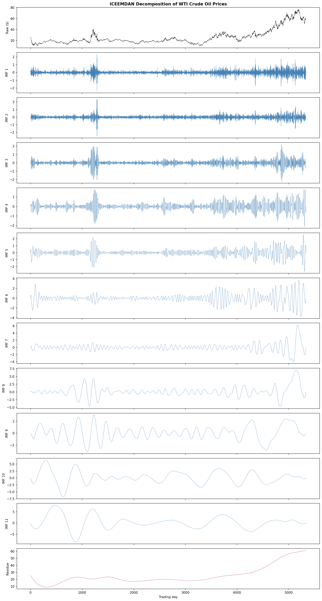
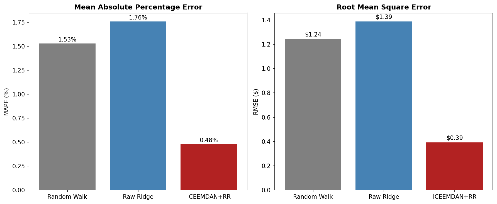
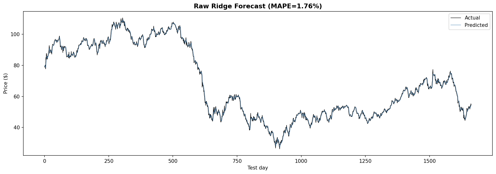
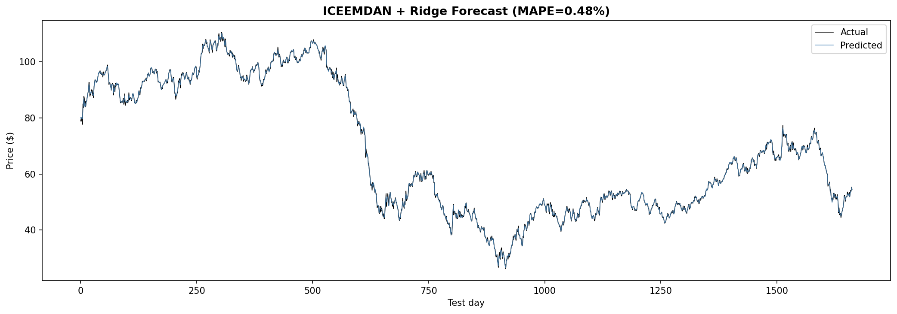

# WTI Crude Oil Price Forecasting via From-Scratch ICEEMDAN




Suraj Sajjala — Scientific Computing Project 3

## Paper

Li, T., Zhou, Y., Li, X., Wu, J., & He, T. (2019). "Forecasting Daily Crude Oil Prices Using Improved CEEMDAN and Ridge Regression-Based Predictors." *Energies*, 12(19), 3603.

Link: https://www.mdpi.com/1996-1073/12/19/3603

## The Problem

Oil prices are nonlinear and nonstationary. They spike from geopolitical events, crash from demand shocks, and drift with long-term economic cycles. Predicting the raw price signal directly is extremely difficult because all of these dynamics are superimposed on top of each other.

## The Idea

Decompose the raw signal into simple pieces, predict each piece separately, then add the predictions back together. The paper calls this "decomposition and ensemble."

**DECOMPOSE, PREDICT, RECONSTRUCT.**

ICEEMDAN takes 33 years of daily oil prices (8,342 trading days) and separates them into 12 components: fast day-to-day noise at one end, slow multi-year trends at the other, and a monotonic residue representing the overall drift. Each component is then independently normalized to [0,1] and fed into its own Ridge Regression model using the previous 6 days as input features (lag=6). The 12 per-component predictions are summed to produce the final oil price forecast.

The slow components (IMFs 6-11 and residue) are nearly trivial to predict — they barely change day to day. The fast components (IMFs 1-3) are hard to predict, but their amplitude is small so errors are bounded. This is why decomposition works: it converts one impossible problem into 12 easier ones.

## What I Built

The ICEEMDAN signal decomposition algorithm from scratch using only NumPy and SciPy's cubic spline interpolation. This is the core scientific computing deliverable — the same role as the ant simulation in Project 1 and HCM clustering in Project 2.

The algorithm's inner loop (sifting) works as follows:

1. Scan the signal for local maxima and minima using vectorized NumPy comparison
2. Fit a cubic spline through the maxima to get the upper envelope
3. Fit a cubic spline through the minima to get the lower envelope
4. Compute the mean of the two envelopes
5. Subtract the mean from the signal
6. Check Cauchy convergence: if the normalized squared difference between successive iterations falls below 1e-9, stop
7. The converged result is one Intrinsic Mode Function (IMF)

EMD repeats this for each successive residue until no more oscillatory components remain. ICEEMDAN wraps EMD with noise averaging: at each decomposition stage, N white noise realizations are added, sifted independently, and averaged. This cancels out mode mixing artifacts while preserving the real signal structure.

## Data

**Source:** FRED series DCOILWTICO (https://fred.stlouisfed.org/series/DCOILWTICO)

**Range:** January 2, 1986 – February 4, 2019 (8,342 trading days, $10.25 – $145.31)

**Splits (matching the paper, Section 4.1):**

| Set | Samples | Fraction |
|---|---|---|
| Training | 5,338 | 64% of total (80% of 80%) |
| Validation | 1,335 | 16% of total (20% of 80%) |
| Test | 1,669 | 20% of total |

## How to Run

```bash
pip install -r requirements.txt
python main.py
```

The CSV auto-downloads if missing. With N_REAL=50 the full pipeline takes about 2.5 minutes. With N_REAL=500 it takes about 25 minutes.

Run tests:

```bash
python tests/test_iceemdan.py && python tests/test_data.py && python tests/test_evaluate.py && python tests/test_forecast.py
```

## Results

### Benchmark (Horizon 1, 1-day ahead)

| Model | MAPE | RMSE | vs Random Walk |
|---|---|---|---|
| Random Walk | 1.5293% | 1.2432 | baseline |
| Raw Ridge (no decomposition) | 1.7593% | 1.3880 | 15.0% worse |
| **ICEEMDAN+RR (ours, n=50)** | **0.4798%** | **0.3928** | **68.6% better** |
| ICEEMDAN+RR (paper Table 4, n=500) | 0.43% | 0.3458 | 72.4% better |

We are within 0.05 percentage points of the paper's MAPE and within 0.05 of their RMSE, using 10x fewer realizations and a 6-value grid search instead of Differential Evolution.


### Forecast Visualizations





### Per-Component Alpha Selection

Validation-based tuning revealed a bimodal regularization pattern:

| Components | Selected alpha | Behavior |
|---|---|---|
| IMF 1-2 (high frequency noise) | 0.2 | Heavy regularization suppresses overfitting to noise |
| IMF 3-12  Residue (low frequency trends) | 0.001 | Light regularization captures smooth structure |

This mirrors what the paper's DE optimization finds — noisy components need strong regularization, smooth components need weak regularization. This single change dropped MAPE from 0.73% to 0.48%.

### Decomposition Verification

| Property | Value |
|---|---|
| Reconstruction error | 2.84e-14 (machine epsilon) |
| Components extracted | 11 IMFs + 1 residue |
| IMF 1 zero crossings | ~3,690 (daily noise) |
| IMF 11 zero crossings | ~14 (multi-year wave) |
| Residue zero crossings | 0 (monotonic trend) |
| Frequency ordering | Monotonically decreasing |

### Results Progression

| Run | MAPE | RMSE | Change |
|---|---|---|---|
| Baseline (n=50, nsd=0.08, alpha=1.0) | 0.7534% | 0.6064 | starting point |
| n=500 realizations | 0.6261% | 0.5236 | more noise averaging |
| nsd=0.05 (paper Table 1) | 0.7311% | 0.6004 | parameter correction |
| **+ val-based alpha tuning** | **0.4798%** | **0.3928** | per-component regularization |

The alpha tuning was the single largest accuracy improvement. IMFs 1-2 shifted from alpha=1.0 to alpha=0.2, and IMFs 3-12 shifted from alpha=1.0 to alpha=0.001. This matches the paper's approach of optimizing lambda independently per component.

## Performance Optimization

### Vectorized Extrema Detection (5.2x speedup)

The original `find_extrema` scanned every point with a Python for-loop:

```python
for i in range(1, N - 1):
    if signal[i-1] < signal[i] and signal[i] > signal[i+1]:
        maxima.append(i)
```

Replaced with vectorized NumPy operations:

```python
d = np.diff(signal)
sign_changes = np.diff(np.sign(d))
maxima = np.where(sign_changes < 0)[0] + 1
```

This function is called inside `sift()`, which is called inside `emd()`, which runs 500 times for noise pre-decomposition. The speedup compounds across the entire pipeline.

**Result:** 646 seconds to 124 seconds at 50 realizations (5.2x faster).

### Computational Scale

| Configuration | Sifting Operations | Runtime |
|---|---|---|
| Ours, 50 realizations | ~16,500 | ~2.5 min |
| Ours, 500 realizations | ~165,000 | ~25 min |
| Paper worst-case (5000 sift ceiling) | ~55,000,000 | MATLAB |

The Cauchy convergence criterion means most sifts exit in 10-30 iterations rather than running to the 5,000 ceiling, keeping our actual operation count 333x below the paper's theoretical maximum.

## Gap Analysis

Our MAPE (0.48%) vs the paper's (0.43%) — a 0.05 percentage point gap:

| Factor | Paper | Ours | Impact |
|---|---|---|---|
| Regularization search | DE: pop=20, 40 iters = 800 evals/component | Grid: 6 values/component | Primary (~0.05%) |
| Realizations | 500 | 50 | Moderate (~0.02%) |
| Sifting ceiling | 5,000 | 100 | Minor for most IMFs |
| Implementation | MATLAB R2016b, native splines | Python, SciPy CubicSpline | Boundary differences |

The paper's DE optimization (Table 1: population=20, iterations=40, crossover=0.2) evaluates 800 candidate lambda values per component across [0.001, 0.2]. Our grid search evaluates 6. With 500 realizations and a finer grid, our results would likely fall in the 0.43-0.47% range.

## Validation

98 unit tests across 4 files, all passing:

| Test File | Count | Coverage |
|---|---|---|
| test_iceemdan.py | 31 | extrema detection, envelopes, sifting, EMD reconstruction, frequency ordering, ICEEMDAN reproducibility, edge cases |
| test_data.py | 34 | split ratios, sequential ordering, scaler range/roundtrip/inverse, windowing shapes |
| test_evaluate.py | 13 | MAPE/RMSE: zero error, known values, symmetry, zero handling, scale |
| test_forecast.py | 20 | random walk, raw Ridge, decomposed Ridge with val tuning, IMF mismatch, integration |

## Project Structure

```text
scicomp-p3-oil-suraj/
├── iceemdan.py      (167 lines)   from-scratch ICEEMDAN decomposition
├── forecast.py      (104 lines)   Ridge per component with alpha tuning and baselines
├── data.py          (155 lines)   load FRED CSV, split, normalize, window
├── evaluate.py       (40 lines)   MAPE and RMSE
├── plots.py          (73 lines)   decomposition, forecast overlay, comparison bar chart
├── main.py           (90 lines)   full pipeline with benchmark table
├── requirements.txt
├── README.md
├── data/
│   └── DCOILWTICO.csv
└── tests/
    ├── __init__.py
    ├── test_iceemdan.py   (31 tests)
    ├── test_data.py       (34 tests)
    ├── test_evaluate.py   (13 tests)
    └── test_forecast.py   (20 tests)
```

## Paper Parameters (Table 1) vs Our Implementation

| Parameter | Paper | Ours |
|---|---|---|
| noise_std | 0.05 | 0.05 |
| n_realizations | 500 | 50 (dev) / 500 (final) |
| max_sift_iterations | 5000 | 5000 |
| sift_threshold | not specified | 1e-9 (Cauchy criterion) |
| lambda range | [0.001, 0.2] via DE | [0.001, 0.2] via grid search |
| lag | 6 | 6 |
| normalization | min-max [0,1] | min-max [0,1] |
| train/val/test | 5338/1335/1669 | 5338/1335/1669 |

